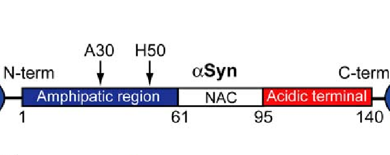
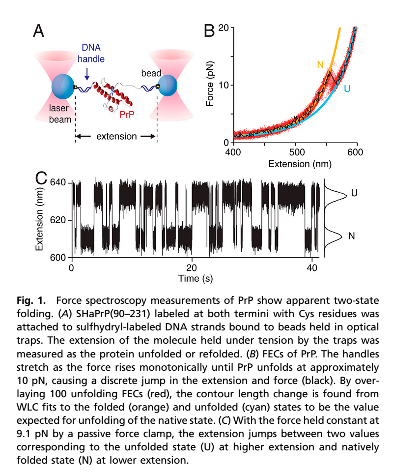
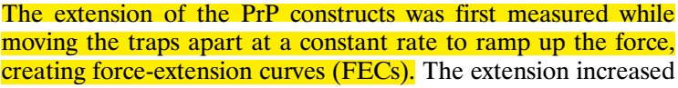
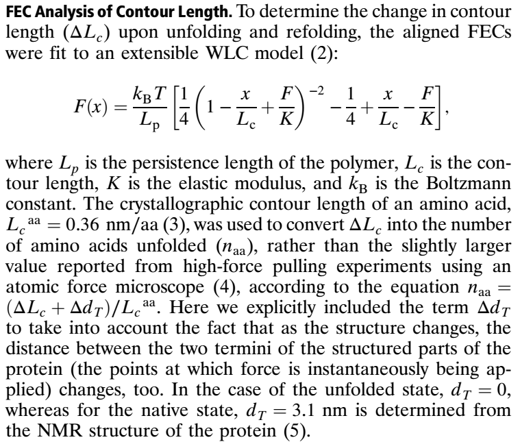

Optical trapping and alpha-syn protein
========

## 1. alpha-syn protein
alph-syn蛋白是一种NUP(Proteins lack a well-defined three-dimentional structure),大小为140-amino acid(约48nm)。

- amphipatic region: 亲水脂性的区域，该区域在接触磷脂膜时会倾向于折叠成alpha-helical结构。其中A30和H50突变为与Cu2+的结合位点。
- NAC:alpha-syn淀粉类蛋白的原纤维核。
- Acidic terminal：酸性c-terminal尾巴，带电，不折叠。

### [reference](http://journals.plos.org/plosbiology/article?id=10.1371/journal.pbio.0060006)

## 2.实验方法
### [以下参看文献](http://sci-hub.tw/10.1073/pnas.1107736109)
folding-unfolding实验：

蛋白两端各有一个CYS residues，用来与巯基标记的DNA handles连接。
FECs的测量：

FEC曲线的分析：
